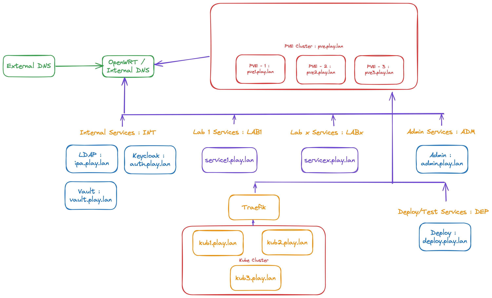

# OpenWRT

## Prerequisites

- Network knowledge
- PVE deployed

## Architecture

Remember, this is the architecture goal we want to have :



  * The INT service is the default "LAN" service.
  * The ADM service is optional, the firewall can be opened from an existing location on your network.
  * The KUB network is where RKE is deployed.
  * The DEP network is used to create and customize updated templates of the VMs used in the architecture.
  * The LAB allows you to create, test and validate information systems...

## Network configuration on Proxmox

To implement this architecture, simply create the associated networks in Proxmox. You can use a classical Linux Bridge or OVS Bridge.

The default interface is left "as is", the default configuration interface for your PVE.


| Network Interface | Network Adresses | Network Name        |
|------------------:|------------------|---------------------|
|              vmbr0|  192.168.30.10/24| PVE Network / WAN   |
|              vmbr1|     172.16.0.0/24| Internal / LAN      |
|              vmbr2|     172.16.1.0/24| Admin               |
|              vmbr3|     172.16.2.0/24| Kube                |
|              vmbr4|     172.16.3.0/24| Deployment          |
|              vmbr5|     172.16.X.0/24| LabX                |

## OpenWRT deployment

You need to SSH to your PVE Node :
```
wget -O openwrt.img.gz https://downloads.openwrt.org/releases/23.05.2/targets/x86/64/openwrt-23.05.2-x86-64-generic-ext4-combined.img.gz
gunzip openwrt-23.05.2-x86-64-generic-ext4-combined.img.gz
qm create 2000 --name openwrt --memory 512 --net0 virtio,bridge=vmbr0 --sockets 1 --cpu cputype=kvm64
qm importdisk 2000 openwrt-23.05.2-x86-64-generic-ext4-combined.img local-lvm
qm set 2000 --scsihw virtio-scsi-pci --scsi0 local-lvm:vm-2000-disk-0
qm set 2000 --boot c --bootdisk scsi0
```

You can start the VM, and login (the root has no password).

## Minimal configuration

### Set the administration adress and SSH

You need to modify the `/etc/config/network` :

```
config interface 'loopback'
        option device 'lo'
        option proto 'static'
        option ipaddr '127.0.0.1'
        option netmask '255.0.0.0'

config globals 'globals'
        option ula_prefix 'fd27:270b:3ecc::/48'

config interface 'wan'
        option device 'eth0'
        option proto 'static'
        option ipaddr '192.168.30.2'
        option netmask '255.255.255.0'
        option gateway '192.168.30.1'
        list dns '192.168.30.1'
        list dns_search 'play.lan'
```
Add a rule for accessing the firewall from outside in the `/etc/config/firewall` file :

```
config rule
        option name 'Allow-Admin-FromWAN'
        list proto 'tcp'
        option src 'wan'
        option dest_port '443 22'
        option target 'ACCEPT'
```

Reload network and firewall :

```
service network reload
service firewall reload
```

### Add Interface to OpenWRT
From Proxmox Server (SSH) :
```
qm set 2000 --net1 virtio,bridge=vmbr1
```
You need to modify `/etc/config/network` and add this configuration.
```
config interface 'int'
        option proto 'static'
        option device 'eth1'
        option ipaddr '172.16.0.1'
        option netmask '255.255.255.0'
```
After you need to configure the default behavior of the "INT" Zone in `/etc/config/firewall` :
```
config zone
        option name 'int'
        option input 'ACCEPT'
        option output 'ACCEPT'
        option forward 'ACCEPT'
        list network 'int'

config forwarding
        option src 'int'
        option dest 'wan'
```
We also add a DHCP Server for the Zone in `/etc/config/dhcp`:
```
config dhcp 'int'
        option interface 'int'
        option start '100'
        option limit '150'
        option leasetime '12h'
```
Reload network and firewall :
```
service network reload
service firewall reload
service dnsmasq reload
```

### DNS Configuration

We need to configure the "external" DNS to point to the "play.lan" network.

For example in AdGuardHome in "Upstream DNS Server", you just need to add this line :

```
[/play.lan/]172.16.0.1
```

Don't forget to add routes to your main router if you want to access to the "internal" networks. In OpenWRT it's in the `Network` ⇒ `Routing` ⇒ `Static IPv4 Routing`

In the `/etc/config/network` you just need to add this lines :

```
config route
        option target '172.16.0.0/24'
        option gateway '192.168.30.2'
        option interface 'LAB'
```