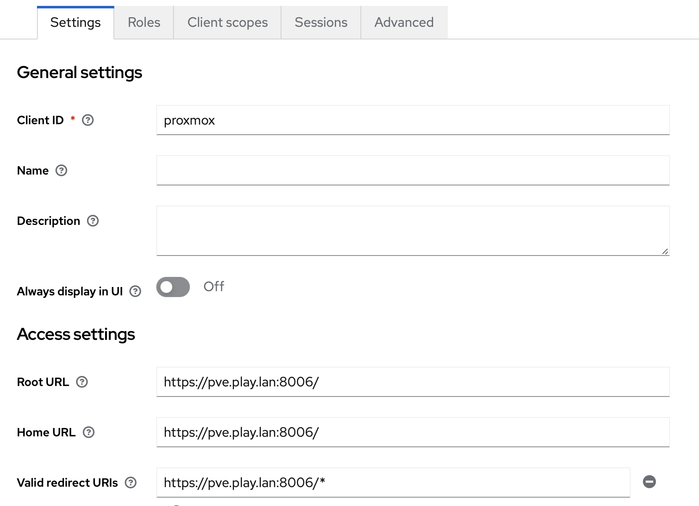
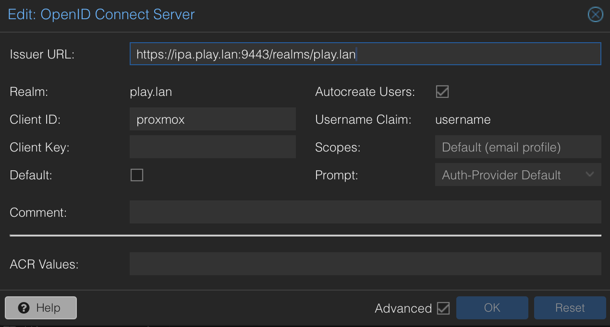

# KeyCloak

FreeIPA is a Identity Provider and a PKI. When you deploy FreeIPA you have by defaut a functionnal PKI inside your Network.

We are going to deploy KeyCloak on docker. We've choosen this type of deployment because it can be temporary. We'll be able to deploy this service on Kube at a later date.

## Prerequisites

- PVE skills
- Docker-Compose skills
- FreeIPA already installed

## Docker Installation

For going faster we can use a docker-compose file. For this installation we can use an old export of an already configured realm. Or we can go from scratch. (A json file will be provided for example).

### Folder creation

We need to create 2 folders :

```
mkdir -p volumes/{ssl,postgres-data}
```

### On FreeIPA

We can directly use the SSL certificate already generated for the HTTPd service.
```
cd ssl
sudo cp /var/lib/ipa/private/httpd.key .
sudo cp /var/lib/ipa/certs/httpd.crt .
```
We need to decrypt the certificate, the auto-generated password is on this folder `/var/lib/ipa/passwds/`:

```
sudo cat /var/lib/ipa/passwds/ipa.play.lan-443-RSA
openssl pkcs8 -topk8 -inform PEM -outform PEM -nocrypt -in httpd.key -out httpd-pkcs8.key
```
Adjust the permissions file :
```
sudo chmod 644 *
```

### Import realms

We can import already existent realm, we just need to put the json files, in this folder : `keycloak-import`. The passwords are changed with "***", you need to change it.

## Tying Keycloak and FreeIPA together

First off, triple check that you can get to both FreeIPA and Keycloak with LetsEncrypt SSL certs and  you can log into both of them. When you can, then we can start tying them together.

There are a few terms you should become familiar with at this point, a very quick layman's overview of these terms are below:

- Realm: A context in which accounts exist and operate together. You can think of this like a Company, Organization, etc.
- Client: A service that will use Keycloak for authentication. This could be something like Nextcloud, GitLab, etc.
- Identity Provider: Services that allow a user to log in. When you go to a website and they give you the option to log in with Facebook, Google, GitHub, etc., they are providing you a choice of Identity Providers. I've seen the most support for SAML within the apps I care about, so we will be setting up SAML when we get to this step.
- User Federation: The process of bringing together accounts from various services so they can be managed in the same way. Complex environments may have a mix of several LDAP, Active Directory, etc. systems that contain various user accounts. In our case, we're just using the LDAP provided by FreeIPA.

### Create a Keycloak Federation User within FreeIPA

Log into FreeIPA and go to `Identity` ⇒ `Groups`. Click `Add` and create a Group named `svc_accounts`.

Click `Identity` ⇒ `Users`. Click `Add` and create a user named `svc_keycloak`. Give it a First and Last name, then select `svc_accounts` from the `GID` dropdown. Set an easy password you can remember as we will reset it in a couple seconds.

Click `Policy` and create a new password policy for the `svc_accounts` group that has a password expiration days of 3650 so these accounts do not expire on you. You can also set the rest of the fields to be more secure since you should be generating very complex passwords for your accounts.

Log out, then try to log in as `svc_keycloak`. Reset the password when prompted. Set a very complex password and take note of it for our User Federation step below.

Log out and log back in with the admin account.

### Give `svc_keycloak` the ability to change user passwords

FreeIPA has `Users` that can be assigned `Roles`, which can be assigned `Permissions`. Permissions get SUPER granular and let your users do various things. For example, we can give our `svc_keycloak` user the ability to change user (and/or admin) passwords by putting that permission in a role and assigning the user that role.

Within FreeIPA, go to `IPA Server` ⇒ `Role-Based Access Control` ⇒ `Privileges` and click `Add`. Name it `Change User Passwords` and click `Add and Edit`. On the `Permissions` tab, click `Add` and find `System: Change User password`. Move it to the right and click `Add`. 

Click `Role-Based Access Control` ⇒ `Roles`. Click `Add` and create a role named `Keycloak Service Account`. Click `Add and Edit`. Under `Users`, click `Add` and add your `svc_keycloak` account. Under `Privileges`, click `Add` and add your `Change User Passwords` privilege.

Your `svc_keycloak` account should now be able to utilize the `Forgot Password?` link on the login pages to reset the passwords of standard user accounts.

### Allow Keycloak to send emails to users

Within Keycloak, go to your realm, then `Realm Settings` ⇒ `Email`. I'm not going to dive too far into it, but here you can set up your standard SMTP email account so that it can send emails. Now you're able to do things like use the `Forgot password?` link on login pages.

### Create a group for users who can use keycloak

I like to have users split into groups defining what services they can access. Go to `Identity` ⇒ `Groups`, click `Add` and create a group like `app_keycloak`.

### Create a User

Now would be a descent time to create a user that we will use with our SSO-enabled services.

Click `Identity` ⇒ `Users`. Click `Add` and fill in the information for your new user. Keep in mind that the password should be easy to remember since you will need to reset it shortly. Click `Add and Edit`.

Click `User Groups`, `Add`, then click the box next to `app_keycloak` and the right arrow, then click `Add`.

Log out, then change the password for this new user to something complex.

### Create a Realm

Next, we will start working in Keycloak.

We could just use the `Master` realm, but I want to create one from scratch. Click `Master` in the top left corner of Keycloak and select `Add realm`. Give your new realm a name and leave `Enabled` as `On`, then click `Create`.

### Add User Federation (FreeIPA's LDAP)

Select `User Federation`, then click the `Add provider...` dropdown and select `ldap`. Set the attributes to the following:

- Console Display Name: `FreeIPA LDAP`
- Edit Mode: `WRITABLE`
- Vendor: `Red Hat Directory Server`
- UUID LDAP Attribute: `ipaUniqueID`
- Connection URL: `ldap://ipa.play.lan`
- Users DN: `cn=users,cn=accounts,dc=play,dc=lan`
- Custom User LDAP Filter: `(&(objectclass=posixaccount)(memberOf=cn=app_keycloak,cn=groups,cn=accounts,dc=play,dc=lan))`
- Bind DN: `uid=svc_keycloak,cn=users,cn=accounts,dc=play,dc=lan`
- Bind Credential: `<password of svc_keycloak>`
- Sync Settings - Periodic Full Sync: `On`
- Sync Settings - Periodic Changed Users Sync: `On`

Leave everything else as default and click `Save`.

If you click on `Test Connection` and it works with the `ldaps` URL, but `Test authentication` doesn't work and you know your creds are valid, make sure your LDAP SSL is working as expected. You can check that it is not self-signed with the `openssl s_client -connect 127.0.0.1:636` command.

Scroll to the bottom and click `Synchronize all users`.

You should now be able to go to `Manage` ⇒ `Users` and click on `View all users`. Doing this should result in the user account you created earlier popping up.

### Fix Mappings

We can see that the `First Name` is actually stored in `givenName`. Make the changes in the Mapper page and click `Save`, then go to `Settings` and synchronize all users. Now going to `Manage` ⇒ `Users` and clicking `View all users` should show you the correct First Name.

For the rest of these, click `Create` and fill in the blanks:

- First Name
    - Type: `user-attribute-ldap-mapper`
    - User Model Attribute: `firstName`
    - LDAP Attribute: `givenName`
- Display Name
    - Type: `user-attribute-ldap-mapper`
    - User Model Attribute: `displayName`
    - LDAP Attribute: `displayName`

### Group Synchronization

You may notice that if you go to `Manage` ⇒ `Groups`, it will not have any of your FreeIPA groups. To fix this, go back to Mappers and create the following. Leave anything not specified as default:

- Groups
    - Type: `group-ldap-mapper`
    - LDAP Groups DN: `cn=groups,cn=accounts,dc=play,dc=lan`

Click Save, then `Sync LDAP Groups to Keycloak`. If you go to Groups, you should now see all your FreeIPA Groups.

Additionally, you should be able to inspect your user and see what groups they are part of.

## Proxmox Integration

### First step : PKI Chain

We are going to configure Proxmox with KeyCloak.

We need to add the CA Certificate inside PVE. The CA Certificate can be found on Web Interface of IPA : `Authentification` ⇒ `Certificates` ⇒ `The fisrt One` (Download)

On PVE put the certificate in this folder `/usr/local/share/ca-certificates/`.

We need to launch `update-ca-certificates`.

### Second step : Add Client

We need to add client from the web interface of KeyCloak :



### Last step : Configure Proxmox

On `Datacenter` ⇒ `node_name` ⇒ `Realms` we can configure a realm.




### Conclusion

You can connect now on PVE with Keycloak and after the first connection, the account is created (You can now add some permissions to this new user).

```
pveum acl modify / -user 'user@play.lan' -role Administrator
```

## References

https://bamhm182.notion.site/FreeIPA-Keycloak-Single-Sign-On-925e3183f4c04f7fbec70787c50941ae