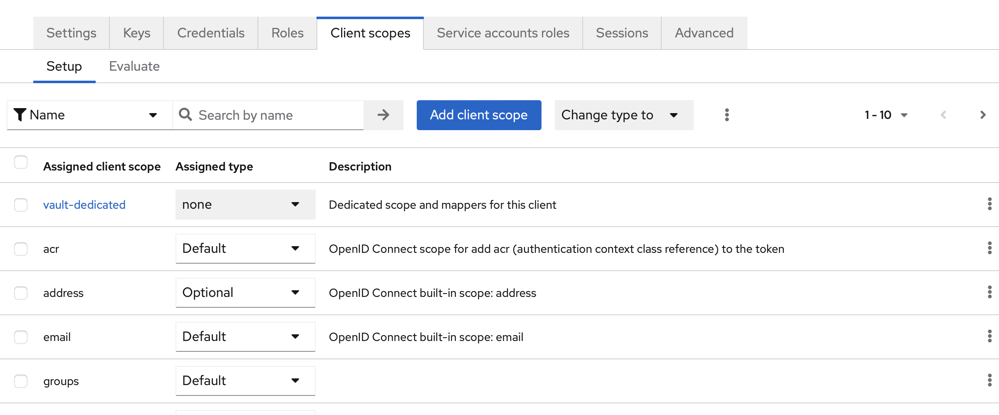

# Vault

## Main goal

This service deployment will be temporary, as it can be deployed later on Kube. But during this process, we need a secret store, to deploy the necessary services.

## Prerequisites

For testing purpose we are using a LXC container. The Alma Linux will be the flavor.

- PVE skills
- Docker-Compose skills
- PKI notions
- FreeIPA & KeyCloak already deployed

## LXC Alma Linux

From the PVE we can deploy an LXC Container. We choose the Alma Linux image. We need to set a temporary password for connecting from console. Don't forget to add a SSH key.

### Configuration of the service

- Memory : 1Gb
- CPU : 1
- Network : 172.16.0.11/24 - Gateway : 172.16.0.1

From PVE (console), we need to install :

- `dnf update`
- `dnf upgrade`
- `dnf install openssh-server`

Change the root password, and we can now use the SSH key (used for the first initialization).

### Resolve docker issues with NetworkManager

You need to add to `/etc/NetworkManager/NetworkManager.conf` this configuration with a wildcard on the name veth*:
```
[keyfile]
unmanaged-devices=interface-name:veth*
```
Then restart the NetworkManager service with:

```
systemctl restart NetworkManager
```

## Vault Installation

### Deploy Docker / Docker-Compose

Docker :
```
dnf install -y yum-utils
yum-config-manager --add-repo https://download.docker.com/linux/centos/docker-ce.repo
dnf -y update
dnf -y install docker-ce docker-ce-cli containerd.io wget
```
Docker-compose :
```
curl -s https://api.github.com/repos/docker/compose/releases/latest \
  | grep browser_download_url \
  | grep docker-compose-linux-x86_64 \
  | cut -d '"' -f 4 \
  | wget -qi -
    
chmod +x docker-compose-linux-x86_64
sudo mv docker-compose-linux-x86_64 /usr/local/bin/docker-compose

systemctl enable docker 
systemctl start docker
```

### Grab a certificate from FreeIPA

```
ipa-client-install --server=ipa.play.lan --domain play.lan --no-ntp

ipa service-add HTTP/vault.play.lan

ipa-getcert request -r -f /etc/pki/tls/certs/vault.play.lan.crt -k /etc/pki/tls/private/vault.play.lan.key -N CN=vault.play.lan -D vault.play.lan -K HTTP/vault.play.lan
```
### Launch the service

Create the folders we need :
```
mkdir -p volumes/{ssl,file,logs}
```
- Copy the certificate and key file in the ssl folder.
- Append the CA certificate (play.lan), in the cert file.

And finaly start the service :

```
docker-compose up -d
```

Finish the configuration in the UI (create admin token and unseal tokens) !!!

## KeyCloak preparation

We just need to configure a new service with credential from KeyCloak.


Note the secret :


Configure groups mapper at "Client Scope" level :


Add groups mapper at "Vault service" level : 




## Vault configuration

### Deploy Vault CLI (for your admin host)

MacOS :
```
brew tap hashicorp/tap
brew install hashicorp/tap/vault
```

Ubuntu :
```
sudo apt update && sudo apt install gpg wget
wget -O- https://apt.releases.hashicorp.com/gpg | sudo gpg --dearmor -o /usr/share/keyrings/hashicorp-archive-keyring.gpg
gpg --no-default-keyring --keyring /usr/share/keyrings/hashicorp-archive-keyring.gpg --fingerprint
echo "deb [arch=$(dpkg --print-architecture) signed-by=/usr/share/keyrings/hashicorp-archive-keyring.gpg] https://apt.releases.hashicorp.com $(lsb_release -cs) main" | sudo tee /etc/apt/sources.list.d/hashicorp.list
sudo apt update && sudo apt install gpg wget
```
Set the needed variables (and open the necessary ports to be able to reach your Vault host (in your `/etc/profile` for example).

```
export VAULT_ADDR="https://vault.play.lan:8200"
export VAULT_TOKEN="xxxxxxxxx"
```

### OIDC Configuration

Extract secret from KeyCloak configuration
```
export CLIENT_SECRET=xxxxx
```

OIDC activation :
```
vault auth enable oidc
```

OIDC configuration :
```
vault write auth/oidc/config \
         oidc_discovery_url="https://ipa.play.lan:9443/realms/play.lan" \
         oidc_client_id="vault" \
         oidc_client_secret="$CLIENT_SECRET" \
         default_role="default"
```
The default account will have default rights. We just need to configure this default account :
```
vault write auth/oidc/role/default \
      bound_audiences="vault" \
      allowed_redirect_uris="https://vault.play.lan:8200/ui/vault/auth/oidc/oidc/callback" \
      allowed_redirect_uris="http://localhost:8250/oidc/callback" \
      user_claim="sub" \
      token_policies="default" \
      groups_claim="groups" \
      role_type="oidc"
```

With `groups_claim`, we just need to make some group correspondance with internal groups, and define internal policies.

### Create 2 policies
- reader
```
path "/secret/*" {
    capabilities = ["read", "list"]
}
```
- vault-admin
```
path "sys/health"
{
  capabilities = ["read", "sudo"]
}

# Create and manage ACL policies broadly across Vault

# List existing policies
path "sys/policies/acl"
{
  capabilities = ["list"]
}

# Create and manage ACL policies
path "sys/policies/acl/*"
{
  capabilities = ["create", "read", "update", "delete", "list", "sudo"]
}

# Enable and manage authentication methods broadly across Vault

# Manage auth methods broadly across Vault
path "auth/*"
{
  capabilities = ["create", "read", "update", "delete", "list", "sudo"]
}

# Create, update, and delete auth methods
path "sys/auth/*"
{
  capabilities = ["create", "update", "delete", "sudo"]
}

# List auth methods
path "sys/auth"
{
  capabilities = ["read"]
}

# Enable and manage the key/value secrets engine at `secret/` path

# List, create, update, and delete key/value secrets
path "secret/*"
{
  capabilities = ["create", "read", "update", "delete", "list", "sudo"]
}

# Manage secrets engines
path "sys/mounts/*"
{
  capabilities = ["create", "read", "update", "delete", "list", "sudo"]
}

# List existing secrets engines.
path "sys/mounts"
{
  capabilities = ["read"]
}

path "*"
{
  capabilities = ["create", "read", "update", "delete", "list", "sudo"]
}
```

### Give groups rights

To map internal groups with OIDC groups, the most effective way is to do from the web interface :

Create the `admins` group from Vault (external group):


Affect an alias (corresponding the OIDC admin group name) :


Affect a security policy :


And do the same for the `reader` group (correpsonding to ipausers group). The result is that every person who is an "ipausers" will have "reader" policies. And every person who is in "vault-admins" will have all the rights in Vault.

After this configuration you will be able to connect from web interface and command line with FreeIPA account.

### PKI role for services

> [!TIP]  
> Best information is on reference document 2.

From command line we activate the PKI service :

```
dnf install -y jq
vault secrets enable -path=pki_int pki
vault secrets tune -max-lease-ttl=43800h pki_int
vault write -format=json pki_int/intermediate/generate/internal \
     common_name="vault.play.lan" \
     issuer_name="play.lan-intermediate" \
     | jq -r '.data.csr' > pki_intermediate.csr
```
We need to submit this certificate request to FreeIPA. We can submit via the web interface or command line. But first step, we need to configure a new certificate template.

SubCA File (`SubCA.cfg`):

```
auth.instance_id=raCertAuth
classId=caEnrollImpl
desc=This certificate profile is for enrolling server certificates with IPA-RA agent authentication.
enable=true
enableBy=ipara
input.i1.class_id=certReqInputImpl
input.i2.class_id=submitterInfoInputImpl
input.list=i1,i2
name=IPA-RA Agent-Authenticated Server Certificate Enrollment
output.list=o1
output.o1.class_id=certOutputImpl
policyset.list=serverCertSet
policyset.serverCertSet.1.constraint.class_id=noConstraintImpl
policyset.serverCertSet.1.constraint.name=No Constraint
policyset.serverCertSet.1.constraint.params.accept=true
policyset.serverCertSet.1.constraint.params.pattern=CN=[^,]+,.+
policyset.serverCertSet.1.default.class_id=userSubjectNameDefaultImpl
policyset.serverCertSet.1.default.name=Subject Name Default
policyset.serverCertSet.1.default.params.name=CN=$request.req_subject_name.cn$, O=PLAY.LAN
policyset.serverCertSet.10.constraint.class_id=noConstraintImpl
policyset.serverCertSet.10.constraint.name=No Constraint
policyset.serverCertSet.10.default.class_id=subjectKeyIdentifierExtDefaultImpl
policyset.serverCertSet.10.default.name=Subject Key Identifier Extension Default
policyset.serverCertSet.10.default.params.critical=false
policyset.serverCertSet.11.constraint.class_id=noConstraintImpl
policyset.serverCertSet.11.constraint.name=No Constraint
policyset.serverCertSet.11.default.class_id=userExtensionDefaultImpl
policyset.serverCertSet.11.default.name=User Supplied Extension Default
policyset.serverCertSet.11.default.params.userExtOID=2.5.29.17
policyset.serverCertSet.12.constraint.class_id=noConstraintImpl
policyset.serverCertSet.12.constraint.name=No Constraint
policyset.serverCertSet.12.default.class_id=commonNameToSANDefaultImpl
policyset.serverCertSet.12.default.name=Copy Common Name to Subject Alternative Name
policyset.serverCertSet.2.constraint.class_id=validityConstraintImpl
policyset.serverCertSet.2.constraint.name=Validity Constraint
policyset.serverCertSet.2.constraint.params.notAfterCheck=false
policyset.serverCertSet.2.constraint.params.notBeforeCheck=false
policyset.serverCertSet.2.constraint.params.range=3650
policyset.serverCertSet.2.default.class_id=validityDefaultImpl
policyset.serverCertSet.2.default.name=Validity Default
policyset.serverCertSet.2.default.params.range=3650
policyset.serverCertSet.2.default.params.startTime=0
policyset.serverCertSet.3.constraint.class_id=keyConstraintImpl
policyset.serverCertSet.3.constraint.name=Key Constraint
policyset.serverCertSet.3.constraint.params.keyParameters=1024,2048,3072,4096,8192
policyset.serverCertSet.3.constraint.params.keyType=RSA
policyset.serverCertSet.3.default.class_id=userKeyDefaultImpl
policyset.serverCertSet.3.default.name=Key Default
policyset.serverCertSet.4.constraint.class_id=noConstraintImpl
policyset.serverCertSet.4.constraint.name=No Constraint
policyset.serverCertSet.4.default.class_id=authorityKeyIdentifierExtDefaultImpl
policyset.serverCertSet.4.default.name=Authority Key Identifier Default
policyset.serverCertSet.5.constraint.class_id=noConstraintImpl
policyset.serverCertSet.5.constraint.name=No Constraint
policyset.serverCertSet.5.default.class_id=authInfoAccessExtDefaultImpl
policyset.serverCertSet.5.default.name=AIA Extension Default
policyset.serverCertSet.5.default.params.authInfoAccessADEnable_0=true
policyset.serverCertSet.5.default.params.authInfoAccessADLocationType_0=URIName
policyset.serverCertSet.5.default.params.authInfoAccessADLocation_0=http://ipa-ca.play.lan/ca
/ocsp
policyset.serverCertSet.5.default.params.authInfoAccessADMethod_0=1.3.6.1.5.5.7.48.1
policyset.serverCertSet.5.default.params.authInfoAccessCritical=false
policyset.serverCertSet.5.default.params.authInfoAccessNumADs=1
policyset.serverCertSet.6.constraint.class_id=keyUsageExtConstraintImpl
policyset.serverCertSet.6.constraint.name=Key Usage Extension Constraint
policyset.serverCertSet.6.constraint.params.keyUsageCritical=true
policyset.serverCertSet.6.constraint.params.keyUsageCrlSign=true
policyset.serverCertSet.6.constraint.params.keyUsageDataEncipherment=true
policyset.serverCertSet.6.constraint.params.keyUsageDecipherOnly=false
policyset.serverCertSet.6.constraint.params.keyUsageDigitalSignature=true
policyset.serverCertSet.6.constraint.params.keyUsageEncipherOnly=false
policyset.serverCertSet.6.constraint.params.keyUsageKeyAgreement=false
policyset.serverCertSet.6.constraint.params.keyUsageKeyCertSign=true
policyset.serverCertSet.6.constraint.params.keyUsageKeyEncipherment=true
policyset.serverCertSet.6.constraint.params.keyUsageNonRepudiation=true
policyset.serverCertSet.6.default.class_id=keyUsageExtDefaultImpl
policyset.serverCertSet.6.default.name=Key Usage Default
policyset.serverCertSet.6.default.params.keyUsageCritical=true
policyset.serverCertSet.6.default.params.keyUsageCrlSign=true
policyset.serverCertSet.6.default.params.keyUsageDataEncipherment=true
policyset.serverCertSet.6.default.params.keyUsageDecipherOnly=false
policyset.serverCertSet.6.default.params.keyUsageDigitalSignature=true
policyset.serverCertSet.6.default.params.keyUsageEncipherOnly=false
policyset.serverCertSet.6.default.params.keyUsageKeyAgreement=false
policyset.serverCertSet.6.default.params.keyUsageKeyCertSign=true
policyset.serverCertSet.6.default.params.keyUsageKeyEncipherment=true
policyset.serverCertSet.6.default.params.keyUsageNonRepudiation=true
policyset.serverCertSet.7.constraint.class_id=noConstraintImpl
policyset.serverCertSet.7.constraint.name=No Constraint
policyset.serverCertSet.7.default.class_id=extendedKeyUsageExtDefaultImpl
policyset.serverCertSet.7.default.name=Extended Key Usage Extension Default
policyset.serverCertSet.7.default.params.exKeyUsageCritical=false
policyset.serverCertSet.7.default.params.exKeyUsageOIDs=1.3.6.1.5.5.7.3.1,1.3.6.1.5.5.7.3.2
policyset.serverCertSet.8.constraint.class_id=signingAlgConstraintImpl
policyset.serverCertSet.8.constraint.name=No Constraint
policyset.serverCertSet.8.constraint.params.signingAlgsAllowed=SHA1withRSA,SHA256withRSA,SHA3
84withRSA,SHA512withRSA,MD5withRSA,MD2withRSA,SHA1withDSA,SHA1withEC,SHA256withEC,SHA384withE
C,SHA512withEC
policyset.serverCertSet.8.default.class_id=signingAlgDefaultImpl
policyset.serverCertSet.8.default.name=Signing Alg
policyset.serverCertSet.8.default.params.signingAlg=-
policyset.serverCertSet.9.constraint.class_id=noConstraintImpl
policyset.serverCertSet.9.constraint.name=No Constraint
policyset.serverCertSet.9.default.class_id=crlDistributionPointsExtDefaultImpl
policyset.serverCertSet.9.default.name=CRL Distribution Points Extension Default
policyset.serverCertSet.9.default.params.crlDistPointsCritical=false
policyset.serverCertSet.9.default.params.crlDistPointsEnable_0=true
policyset.serverCertSet.9.default.params.crlDistPointsIssuerName_0=CN=Certificate Authority,o
=ipaca
policyset.serverCertSet.9.default.params.crlDistPointsIssuerType_0=DirectoryName
policyset.serverCertSet.9.default.params.crlDistPointsNum=1
policyset.serverCertSet.9.default.params.crlDistPointsPointName_0=http://ipa-ca.play.lan/ipa/
crl/MasterCRL.bin
policyset.serverCertSet.9.default.params.crlDistPointsPointType_0=URIName
policyset.serverCertSet.9.default.params.crlDistPointsReasons_0=
policyset.serverCertSet.15.constraint.class_id=basicConstraintsExtConstraintImpl
policyset.serverCertSet.15.constraint.name=Basic Constraint Extension Constraint
policyset.serverCertSet.15.constraint.params.basicConstraintsCritical=true
policyset.serverCertSet.15.constraint.params.basicConstraintsIsCA=true
policyset.serverCertSet.15.constraint.params.basicConstraintsMinPathLen=0
policyset.serverCertSet.15.constraint.params.basicConstraintsMaxPathLen=0
policyset.serverCertSet.15.default.class_id=basicConstraintsExtDefaultImpl
policyset.serverCertSet.15.default.name=Basic Constraints Extension Default
policyset.serverCertSet.15.default.params.basicConstraintsCritical=true
policyset.serverCertSet.15.default.params.basicConstraintsIsCA=true
policyset.serverCertSet.15.default.params.basicConstraintsPathLen=0
policyset.serverCertSet.list=1,2,3,4,5,6,8,9,10,11,15
profileId=SubCA
visible=false
```
We need to connect to ipa :
```
kinit admin
```
And import this new certificate template :
```
ipa certprofile-import SubCA --desc "Subordinate CA" --file SubCA.cfg --store=1
```
And finaly generate the certificate :
```
ipa caacl-add SubCA
ipa caacl-add-profile SubCA --certprofile SubCA
ipa caacl-add-ca SubCA --ca ipa
ipa caacl-add-host SubCA --hosts vault.play.lan
ipa cert-request pki_intermediate.csr --principal=host/vault.play.lan --profile-id SubCA
```
Copy this new generated certificate to your "command center". And add the certificate to Vault.
```
vault write pki_int/intermediate/set-signed certificate=@intermediate.cert.pem
```
You have now an subordinate PKI !!!

### ACME Responder

For a complete integration with services we need an ACME Responder to generate certificates automatically.

```
vault write pki_int/config/cluster path=https://vault.play.lan:8200/v1/pki_int aia_path=https://vault.play.lan:8200/v1/pki_int
vault write pki_int/roles/learn issuer_ref="$(vault read -field=default pki_int/config/issuers)" allow_any_name=true max_ttl="720h" no_store=false
vault secrets tune \
 -passthrough-request-headers=If-Modified-Since \
 -allowed-response-headers=Last-Modified \
 -allowed-response-headers=Location \
 -allowed-response-headers=Replay-Nonce \
 -allowed-response-headers=Link \
 pki_int
vault write pki_int/config/acme enabled=true
```

### Examples

Routes must be opened from the play.lan (OpenWRT) firewall. By default, the 2 components of this LAB have access.

#### PVE

```
pvenode acme account register default root@play.lan --directory https://vault.play.lan:8200/v1/pki_int/acme/directory
pvenode config set --acme domains=pve.play.lan
pvenode acme cert order
```

#### Openwrt

> [!IMPORTANT]
> Ignore LuCI configuration, it's not working anymore.

```
opkg update
opkg install acme acme-dnsapi luci-app-acme
```
Update the package :
```
wget https://raw.githubusercontent.com/acmesh-official/acme.sh/master/acme.sh
chmod +x acme.sh
./acme.sh --install --home /usr/lib/acme --cert-home /etc/acme/certs --config-home /etc/acme/config --accountemail root@play.lan --accountkey /etc/acme/account --useragent "" --log /var/log/acme.log
```
Add defaut server in `/etc/acme/config/account.conf` :
```
DEFAULT_ACME_SERVER='https://vault.play.lan:8200/v1/pki_int/acme/directory'
```
Add these lines in  `/etc/profile`
```
export LE_WORKING_DIR="/usr/lib/acme"
export LE_CONFIG_HOME="/etc/acme/config"
alias acme.sh="/usr/lib/acme/acme.sh --config-home '/etc/acme/config'"
```
Issue certificate :
```
acme.sh --issue --standalone -d openwrt.play.lan
```
Verifiy crontab (you can add a reload command for `uhttpd`) :
```
29 6 * * * "/usr/lib/acme"/acme.sh --cron --home "/usr/lib/acme" --config-home "/etc/acme/con
29 6 * * * /etc/init.d/uhttpd reload
```
Change uhhtpd configuration (`/etc/config/uhttpd`) :
```
option cert '/etc/acme/certs/openwrt.play.lan_ecc/fullchain.cer'
option key '/etc/acme/certs/openwrt.play.lan_ecc/openwrt.play.lan.key'
```
## References

1. https://www.spicyomelet.com/sso-with-keycloak-and-hashicorp-vault/
1. https://frasertweedale.github.io/blog-redhat/posts/2018-08-21-ipa-subordinate-ca.html
1. https://developer.hashicorp.com/vault/tutorials/auth-methods/vault-oidc-okta
1. https://developer.hashicorp.com/vault/tutorials/secrets-management/pki-acme-caddy
1. https://wiki.terrabase.info/wiki/LetsEncrypt_with_ACME_on_OpenWRT