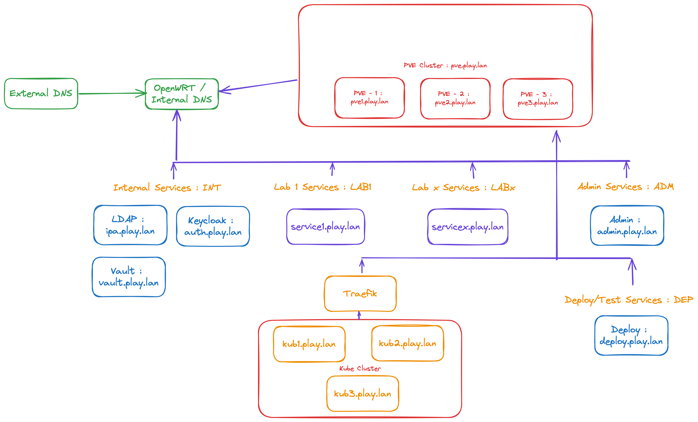
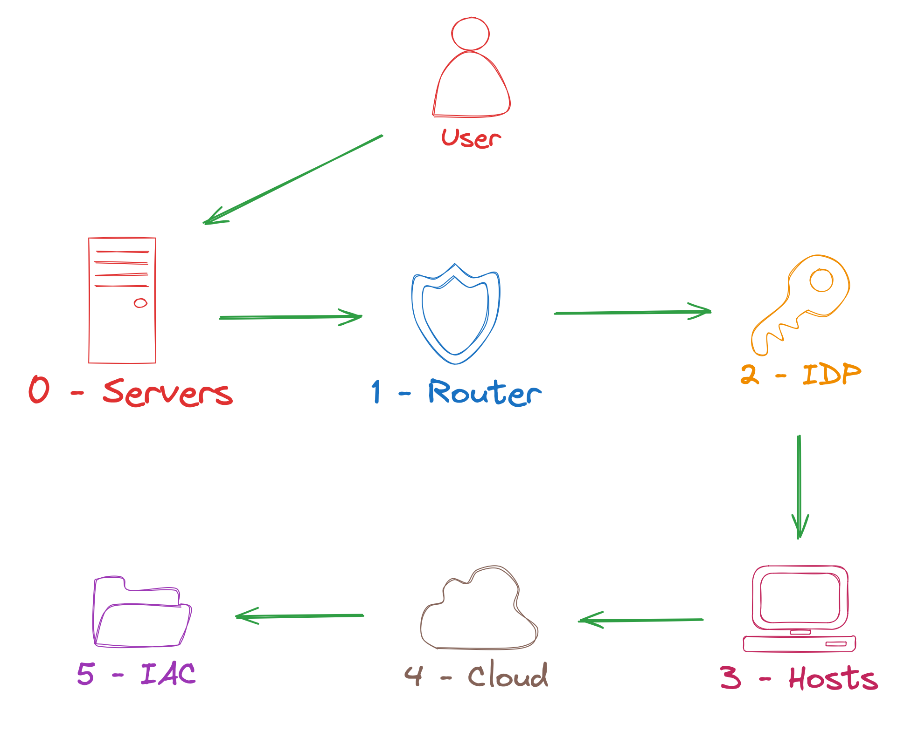

# iac-magic-box
A toolbox for creating IaC on Proxmox

## 00 - Introduction

### Goal

The aim of this project is to provide the glue needed to build a beginning of Cloud and IaC on the Proxmox hypervisor. Evolutions will be planned to potentially support other hypervisors, but for now we're choosing the path of freedom.

Many projects already exist on this theme, and we'll credit them all as references. However, few clearly explain the path to a ready-to-use environment for designing I.S. and services in "code" form.

It's a long road, but it's already begun.

### Architecture

In the firsts step services will be deployed manually. We can find all the documentation in the corresponding folders.

In the examples, we use the "play.lan" domain. For the moment, everything is hard-coded, so you'll have to use your brain to modify it.

### Step by step

We decided to order the files to impose an order of deployment.

## 01 - Proxmox

Proxmox is one of the best hypervisor and freely accessible. Since there's never a perfect choice, this one's a little self-imposed.

Proxmox documentation is abundant, and the official website is really full of resources. There will therefore be a few deviations in our documentation, and we invite you to refer to the official documentation for the installation and deployment of a standalone hypervisor or a cluster.

It is compatible with cloud images and cloud-init images. It's a perfect start for IaC.

[Proxmox Documentation](./01-proxmox/README.md)

> [!NOTE] 
> In this documentation, we will deal with the most common case, usually referring to a single node. It's up to you to adapt the scripts and documentation if you have several nodes and want to deploy the services elsewhere. The node name, the storage name, the pool name must be adapted to your configuration.

## 10 - OpenWRT

OpenWRT is choosen for its lightweight footprint for the core network. It's the main router/firewall of our architecture.

[Openwrt Documentation](./10-openwrt/README.md)

## 20 - FreeIPA

We chose this software because it contains LDAP for user management (and the user interface for user management). It provides a PKI infrastructure and can also manage client hosts.

[FreeIPA Documentation](./20-freeipa/README.md)

## 21 - Keycloak

KeyCloak is FreeIPA's companion, mainly maintained by RedHat teams. It ensures compatibility with SSO protocols, especially OIDC.

[KeyCloak Documentation](./21-keycloak/README.md)

## 22 - Vault

We need a way to manage secrets and certificates, and Vault is the leading product for this. It is fully compatible with all IaC languages.

[Vault Documentation](./22-vault/README.md)

## 30 - Packer

The first step is to create the images needed to offer the VPS service. This part provides the minimum OS to support the services to be deployed. In the case of laboratories, these images can also be used to test and emulate a complete Information System.

Different steps and prerequisites are required to make this part work. Each Packer subfolder contains documentation relating to its part.

[Packer Documentation](./30-packer/README.md)

## 40 - Terraform / RKE2

### Terraform

The Terraform part is left up to users to deploy their own services and I.S. as they see fit. However, examples will be provided. 
We will provide an example to deploy RKE2 in our infrastructure (it will be the main Terraform project).

### RKE2

RKE2 is chosen by default for the Kubernetes part, as it is complete and secure.

## 50 - Ansible

Some Ansible Playbook will be used mainly for operational purpose.

## 90 - Contrib

You can contrib to this project. You just need to follow namings convention of this project.

## 99 - Assets

An asset folder will be present (in each subfolder) for storing images used in the documentation.