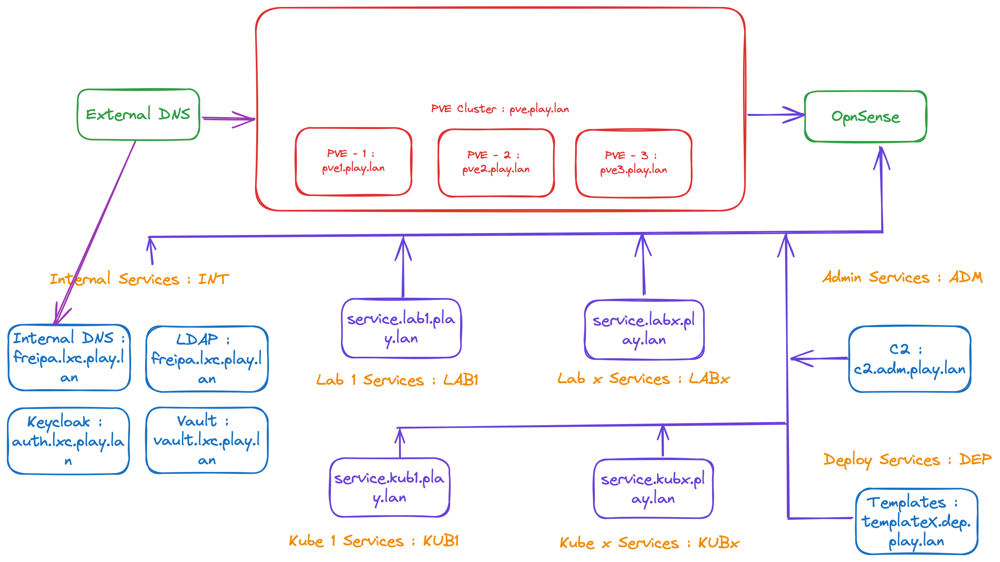
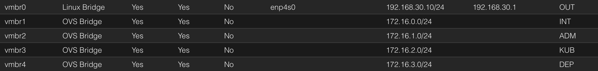

# VyOS

## Network organisation

This is the architecture goal we want to have :



  * The INT service is the default "LAN" service.
  * The ADM service is optional, the firewall can be opened from an existing location on your network.
  * The KUB network is where RKE is deployed.
  * The DEP network is used to create and customize updated templates of the VMs used in the architecture.
  * The LAB allows you to create, test and validate information systems...

## Network configuration on Proxmox

To implement this architecture, simply create the associated networks in Proxmox. You can use a classical Linux Bridge or OVS Bridge.

The default interface is left "as is", the default configuration interface for your PVE.



| Network Interface | Network Adresses | Network Name |
|------------------:|------------------|--------------|
|              vmbr0|  192.168.30.10/24| PVE Network  |
|              vmbr1|     172.16.0.0/24| Internal     |
|              vmbr2|     172.16.1.0/24| Admin        |
|              vmbr3|     172.16.2.0/24| Kube         |
|              vmbr4|     172.16.3.0/24| Deployment   |

## VyOS deployment

For this step we use the official [documentation](https://docs.vyos.io/en/latest/). And this [part](https://docs.vyos.io/en/latest/installation/virtual/proxmox.html) is the most interesting. You need a valid subscription to access the latest "QCOW" image, so we will follow "the long way" with more graphic interaction.

  * Download the rolling release iso from https://vyos.net/get/nightly-builds/. Non-subscribers can always get the LTS release by building it from source. Instructions can be found in the Build VyOS section of this manual. VyOS source code repository is available https://github.com/vyos/vyos-build.
  * Prepare VM for installation from ISO media. The commands below assume that your iso is available in a storage pool ‘local’, that you want it to have a VM ID ‘200’ and want to create a new disk on storage pool ‘local-lvm’ of size 15GB.

```
qm create 200 --name vyos --memory 2048 --net0 virtio,bridge=vmbr0 --ide2 media=cdrom,file=local:iso/vyos-1.x-rolling-202xxxxxxxxx.iso --virtio0 local-lvm:15
```
  * Start the VM using the command ```qm start 200``` or using the start button located in the proxmox GUI.
  * Using the proxmox webGUI, open the virtual console for your newly created vm. Login username/password is ```vyos/vyos```.
  * Once booted into the live system, type ```install image``` into the command line and follow the prompts to install VyOS to the virtual drive.
  * After installation has completed, remove the installation iso using the GUI or ```qm set 200 --ide2 none```.
  * Reboot the virtual machine using the GUI or ```qm reboot 200```.

## Minimal configuration

### Set the administration adress and SSH

You need to type these commands from the Proxmox GUI:

```
configure
set interfaces ethernet eth0 address 192.168.30.2/24
set protocols static route 0.0.0.0/0 next-hop 192.168.30.1
set system name-server 192.168.30.1
set service ssh port 22
commit
save
```
After that it will be more effective to continue with SSH to configure VyOS.

### Add interface to VyOS

From Proxmox :

```
qm set 200 --net1 virtio,bridge=vmbr1
```
From VyOS :
```
configure
set interfaces ethernet eth1 address 172.16.0.1/24
commit
save
```
### Add DHCP and DNS Forwarding

From VyOS :
```
configure
# DHCP
set service dhcp-server shared-network-name INT subnet 172.16.0.0/24 default-router '172.16.0.1'
set service dhcp-server shared-network-name INT subnet 172.16.0.0/24 name-server '172.16.0.1'
set service dhcp-server shared-network-name INT subnet 172.16.0.0/24 domain-name 'int.play.lan'
set service dhcp-server shared-network-name INT subnet 172.16.0.0/24 lease '86400'
set service dhcp-server shared-network-name INT subnet 172.16.0.0/24 range 0 start '172.16.0.10'
set service dhcp-server shared-network-name INT subnet 172.16.0.0/24 range 0 stop '172.16.0.50'
# DNS
set service dns forwarding cache-size '0'
set service dns forwarding listen-address '172.16.0.1'
set service dns forwarding allow-from '172.16.0.0/24'
set service dns forwarding name-server '192.168.30.1'
commit
save
```

### Add Masquerading for this new network

```
configure
set nat source rule 100 outbound-interface name 'eth0'
set nat source rule 100 source address '172.16.0.0/24'
set nat source rule 100 translation address masquerade
commit
save
```

## Firewall Configuration

### Create Firewall Groups

```
configure
set firewall group interface-group WAN interface eth0
set firewall group interface-group INT interface eth1
set firewall group network-group NET-INSIDE-v4 network '172.16.0.0/24'
```

### Stateful inspection with dedicated table

```
set firewall ipv4 name CONN_FILTER default-action 'return'

set firewall ipv4 name CONN_FILTER rule 10 action 'accept'
set firewall ipv4 name CONN_FILTER rule 10 state established
set firewall ipv4 name CONN_FILTER rule 10 state related

set firewall ipv4 name CONN_FILTER rule 20 action 'drop'
set firewall ipv4 name CONN_FILTER rule 20 state invalid

set firewall ipv4 forward filter rule 10 action 'jump'
set firewall ipv4 forward filter rule 10 jump-target CONN_FILTER

set firewall ipv4 input filter rule 10 action 'jump'
set firewall ipv4 input filter rule 10 jump-target CONN_FILTER
```

### Block input traffic

```
set firewall ipv4 name OUTSIDE-IN default-action 'drop'

set firewall ipv4 forward filter rule 100 action jump
set firewall ipv4 forward filter rule 100 jump-target OUTSIDE-IN
set firewall ipv4 forward filter rule 100 inbound-interface group WAN
set firewall ipv4 forward filter rule 100 destination group network-group NET-INSIDE-v4
```

### Autorize access to adminstration

Thi access is unlimited from LAN and limited from WAN to block btute force attacks.

Configure a new chain for management access :
```
set firewall ipv4 name VyOS_MANAGEMENT default-action 'return'
```
We configure a rule to filter 22 port :
```
set firewall ipv4 input filter rule 20 action jump
set firewall ipv4 input filter rule 20 jump-target VyOS_MANAGEMENT
set firewall ipv4 input filter rule 20 destination port 22
set firewall ipv4 input filter rule 20 protocol tcp
```
Accept connections from INT and limit from WAN :
```
set firewall ipv4 name VyOS_MANAGEMENT rule 15 action 'accept'
set firewall ipv4 name VyOS_MANAGEMENT rule 15 inbound-interface group 'INT'

set firewall ipv4 name VyOS_MANAGEMENT rule 20 action 'drop'
set firewall ipv4 name VyOS_MANAGEMENT rule 20 recent count 4
set firewall ipv4 name VyOS_MANAGEMENT rule 20 recent time minute
set firewall ipv4 name VyOS_MANAGEMENT rule 20 state new
set firewall ipv4 name VyOS_MANAGEMENT rule 20 inbound-interface group 'WAN'

set firewall ipv4 name VyOS_MANAGEMENT rule 21 action 'accept'
set firewall ipv4 name VyOS_MANAGEMENT rule 21 state new
set firewall ipv4 name VyOS_MANAGEMENT rule 21 inbound-interface group 'WAN'
```

### Autorize services access (from INT)
```
set firewall ipv4 input filter rule 30 action 'accept'
set firewall ipv4 input filter rule 30 icmp type-name 'echo-request'
set firewall ipv4 input filter rule 30 protocol 'icmp'
set firewall ipv4 input filter rule 30 state new

set firewall ipv4 input filter rule 40 action 'accept'
set firewall ipv4 input filter rule 40 destination port '53'
set firewall ipv4 input filter rule 40 protocol 'tcp_udp'
set firewall ipv4 input filter rule 40 source group network-group NET-INSIDE-v4
```

### Accept all from localhost

```
set firewall ipv4 input filter rule 50 action 'accept'
set firewall ipv4 input filter rule 50 source address 127.0.0.0/8
commit
save
```

# Sources

https://docs.vyos.io/en/latest/quick-start.html